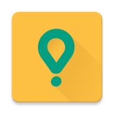
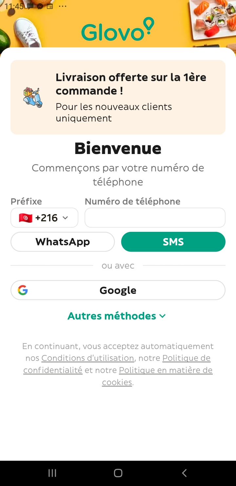
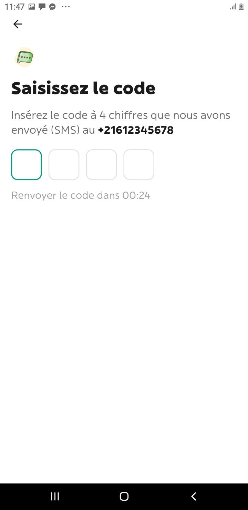
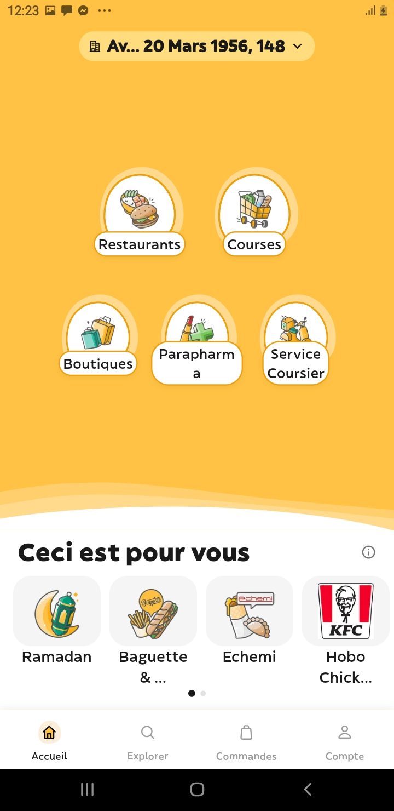
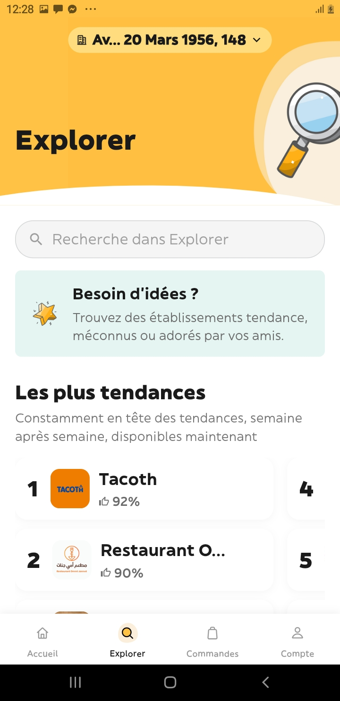
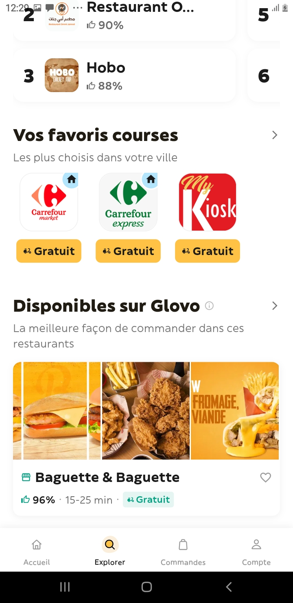
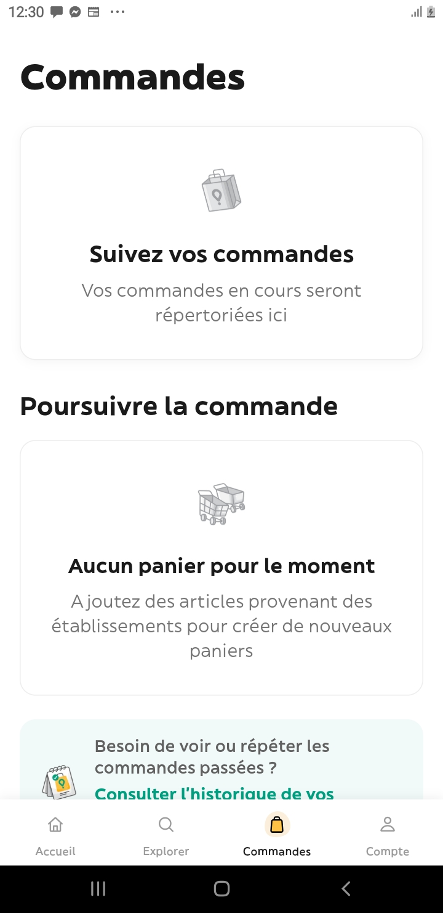
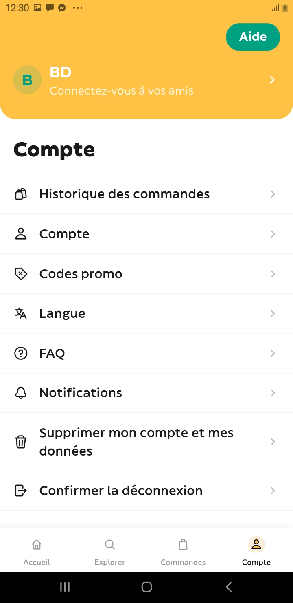
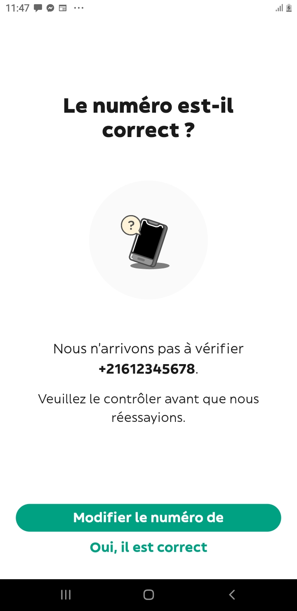

<p align="center">
  
</p>

<h1 align="center">Glovo Clone – Flutter UI Recreation</h1>

<p align="center">
  A pixel-inspired, non-commercial Flutter clone of the <a href="https://glovoapp.com">Glovo</a> delivery app UI.
  <br/>
  <strong>⚠️ This is NOT an official Glovo product. It is a personal project built for learning and portfolio purposes only.</strong>
</p>

<p align="center">
  
  
  
  
</p>

---

## 📖 About

This project is a **UI clone** of the popular food & delivery app **Glovo**, built entirely with **Flutter**. The goal was to replicate the look and feel of the original Glovo app as closely as possible — while understanding that **this is NOT a 100% copy**. Some screens, animations, and features have been adapted, simplified, or reimagined to fit the scope of a personal project.

> **Disclaimer:** This project is intended **solely for educational and portfolio purposes**. It is not affiliated with, endorsed by, or connected to Glovo in any way. No real data, API, or backend services from Glovo are used. All trademarks belong to their respective owners.

---

## 📸 Screenshots

<table>
  <tr>
    <td align="center"><strong>Login</strong></td>
    <td align="center"><strong>Verification</strong></td>
    <td align="center"><strong>Home</strong></td>
    <td align="center"><strong>Explorer</strong></td>
  </tr>
  <tr>
    <td></td>
    <td></td>
    <td></td>
    <td></td>
  </tr>
  <tr>
    <td align="center"><strong>Explorer (Details)</strong></td>
    <td align="center"><strong>Orders</strong></td>
    <td align="center"><strong>Profile</strong></td>
    <td align="center"><strong>Modify</strong></td>
  </tr>
  <tr>
    <td></td>
    <td></td>
    <td></td>
    <td></td>
  </tr>
</table>

---

## ✨ Features

- 🔐 **Login & Verification** – Phone number authentication flow with OTP verification UI
- 🏠 **Home Screen** – Category browsing, promo banners, and restaurant listings
- 🔍 **Explorer Screen** – Discover restaurants, cuisines, and food categories
- 📦 **Orders Screen** – View past and current orders
- 👤 **Profile / Account Screen** – User profile management UI
- ✏️ **Modify Screen** – Edit user information
- 🎨 **Custom Fonts** – Uses Glovo's original font family (Black, Bold, Book, Medium) + WorkSans
- 🎞️ **Lottie Animations** – Smooth, delightful animations throughout the app
- 📱 **SVG Assets** – Crisp vector graphics for icons and illustrations
- 🧭 **Bottom Navigation** – Seamless tab-based navigation (Home, Explorer, Orders, Account)

---

## 🛠️ Tech Stack

| Technology | Purpose |
|---|---|
| **Flutter** | Cross-platform UI framework |
| **Dart** | Programming language |
| **flutter_svg** | SVG rendering |
| **Lottie** | Animation playback |
| **Custom Fonts** | Glovo-inspired typography |

---

## 🚀 Getting Started

### Prerequisites

- [Flutter SDK](https://docs.flutter.dev/get-started/install) (3.x or later)
- [Dart SDK](https://dart.dev/get-dart) (3.x or later)
- Android Studio / VS Code with Flutter extensions
- An Android or iOS emulator, or a physical device

### Installation

```bash
# Clone the repository
git clone https://github.com/YOUR_USERNAME/glovo-clone.git

# Navigate to the project directory
cd glovo-clone/glovo

# Install dependencies
flutter pub get

# Run the app
flutter run
```

---

## 📂 Project Structure

```
glovo/
├── assets/
│   ├── fonts/          # Custom Glovo & WorkSans fonts
│   ├── images/         # PNG assets (categories, restaurants, icons…)
│   ├── lotties/        # Lottie animation files
│   └── svgs/           # SVG vector assets
├── lib/
│   ├── constants/      # App-wide constants (colors, styles…)
│   ├── screens/        # All app screens
│   │   ├── home_screen.dart
│   │   ├── explorer_screen.dart
│   │   ├── orders_screen.dart
│   │   ├── account_screen.dart
│   │   ├── login_screen.dart
│   │   ├── verification_screen.dart
│   │   └── ...
│   ├── widgets/        # Reusable UI components
│   └── main.dart       # App entry point
├── screenshots/        # App screenshots
└── pubspec.yaml        # Flutter project configuration
```

---

## ⚠️ What's Different from the Original Glovo App?

This is a **UI-only** project with **no backend** integration. Here's what differs:

| Aspect | Original Glovo | This Clone |
|---|---|---|
| Backend / API | Full production backend | ❌ No backend – static UI only |
| Payments | Real payment processing | ❌ Not implemented |
| Live Tracking | Real-time order tracking | ❌ Not implemented |
| Authentication | Real phone/email auth | 🎨 UI only (no real auth) |
| Data | Live restaurant & product data | 📦 Static / mock data |
| All Screens | 50+ screens | 🔢 ~10 key screens recreated |
| Animations | Proprietary animations | 🎞️ Lottie-based alternatives |

---

## 🤝 Contributing

Contributions, issues, and feature requests are welcome! Feel free to check the [issues page](https://github.com/YOUR_USERNAME/glovo-clone/issues).

1. Fork the project
2. Create your feature branch (`git checkout -b feature/amazing-feature`)
3. Commit your changes (`git commit -m 'Add some amazing feature'`)
4. Push to the branch (`git push origin feature/amazing-feature`)
5. Open a Pull Request

---

## 📄 License

This project is licensed under the **MIT License**. See the [LICENSE](LICENSE) file for details.

---

## 🙏 Acknowledgements

- [Glovo](https://glovoapp.com) – for the design inspiration
- [Flutter](https://flutter.dev) – for the amazing cross-platform framework
- [Lottie](https://airbnb.io/lottie/) – for beautiful animations
- [flutter_svg](https://pub.dev/packages/flutter_svg) – for SVG support

---

<p align="center">
  Made with ❤️ and Flutter
  <br/>
  <strong>This project is for educational purposes only and is not affiliated with Glovo.</strong>
</p>
